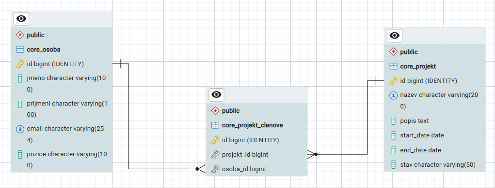

# 🏢 Podnikový informační systém — Backend (REST API)

Tento repozitář obsahuje backendovou část aplikace napsanou ve frameworku **Django** a **Django REST Framework**. Jako databáze je použito **PostgreSQL**.

Aplikace umožňuje zadávat informace o projektech (název, popis, datum zahájení, datum ukončení, stav projektu, členy projektového týmu). 
Název projektu musí být unikátní. Stav projektu může nabývat jedné z hodnot ve statickém select boxu (Příprava, V realizaci, Pozastaven, Dokončen).
Dále lze registrovat osoby, které se mohou účastnit projektů, tj. mohou být členy projektových týmů. U osoby se ukládá jméno, příjmení, email a pozice.
Email musí být unikátní. 

Aplikace podporuje standardně operace CRUD. Vyhledávat lze fulltextově, u projektů též podle stavu projektu pomocí statického select boxu,
u osob též podle pozice pomocí dynamického select boxu.

Pokud jde o operaci Delete, provádí fyzický výmaz z databáze. Aplikace neprovádí žádnou archivaci ani historizaci dat.

### 🔗 Propojení
* **Frontend repozitář najdete zde:** [https://github.com/cestmirstrmiska/evidence-projektu-frontend]

### 🛠️ Prerekvizity a setup databáze
Před spuštěním aplikace je nutné mít nainstalovaný **PostgreSQL server** a vytvořenou prázdnou databázi. Přihlašovací údaje k databázi (název, uživatel, heslo) si upravte lokálně ve vašem souboru `config/settings.py` v sekci `DATABASES`.

### 🚀 Jak spustit backend lokálně:
1. **Aktivujte virtuální prostředí:**
   `venv\Scripts\activate` (Windows) nebo `source venv/bin/activate` (Mac/Linux)
2. **Nainstalujte veškeré závislé knihovny:**
   `pip install -r requirements.txt`
3. **Spusťte databázové migrace:**
   `python manage.py migrate`
4. **(Optional) Inicializujte databázi výchozími testovacími daty (Seeding):**
   `python manage.py loaddata core/initial_data.json`
5. **Spusťte vývojový server:**
   `python manage.py runserver`

Backend bude po spuštění naslouchat a poskytovat REST API na adrese `http://127.0.0.1:8000/api`.

---

## 🗺️ Databázové schéma (ER diagram)
Níže je zobrazen vztah mezi tabulkami v relační databázi PostgreSQL. Vazba mezi Projektem a Osobu je typu **Many-to-Many (M:N)** a je realizována skrze propojovací tabulku.

---
Poznámka: 
- Nad tabulkou projektů jsou vytvořeny indexy pro zajištění unikátnosti a pro vyhledávání podle názvu.
- Podobně nad tabulkou osob jsou indexy pro email. 
- Podle potřeby lze doplnit indexy pro další sloupce.

## ⚙️ Přehled API endpointů (CRUD specifikace)

REST API vrací i přijímá data výhradně ve formátu **JSON** a automaticky podporuje serverové vyhledávání (přes parametr `?search=`) a stránkování.

### 👥 Modul Osoby (`/api/osoby/`)

| Metoda | Endpoint | Popis | Příklad JSON těla (Request Body) |
| :--- | :--- | :--- | :--- |
| **GET** | `/api/osoby/` | Výpis osob (stránkovaný) | *(Žádné)* |
| **GET** | `/api/osoby/?search=Jan` | Fulltextové vyhledávání osob | *(Žádné)* |
| **POST** | `/api/osoby/` | Registrace nové osoby | `{"jmeno": "Jan", "prijmeni": "Novák", "email": "jan.novak@firma.cz", "pozice": "Developer"}` |
| **GET** | `/api/osoby/{id}/` | Detail konkrétní osoby | *(Žádné)* |
| **PUT** | `/api/osoby/{id}/` | Kompletní aktualizace osoby | `{"jmeno": "Jan", "prijmeni": "Novák", "email": "novak.jan@firma.cz", "pozice": "Senior Developer"}` |
| **PATCH** | `/api/osoby/{id}/` | Částečná úprava (např. jen pozice) | `{"pozice": "Team Lead"}` |
| **DELETE** | `/api/osoby/{id}/` | Smazání osoby z registru | *(Žádné)* |

---

### 📁 Modul Projekty (`/api/projekty/`)

| Metoda | Endpoint | Popis | Příklad JSON těla (Request Body) |
| :--- | :--- | :--- | :--- |
| **GET** | `/api/projekty/` | Výpis projektů včetně detailů členů | *(Žádné)* |
| **POST** | `/api/projekty/` | Založení projektu (pole clenove přijímá ID) | `{"nazev": "E-shop", "popis": "Nový web", "start_date": "2026-01-01", "end_date": null, "stav": "Příprava", "clenove": [1, 3]}` |
| **GET** | `/api/projekty//` | Detail konkrétního projektu | *(Žádné)* |
| **PUT** | `/api/projekty/{id}/` | Kompletní aktualizace projektu | `{"nazev": "E-shop v2", "popis": "Update", "start_date": "2026-01-01", "end_date": "2026-12-31", "stav": "Realizace", "clenove": [1]}` |
| **DELETE** | `/api/projekty/{id}/` | Smazání projektu | *(Žádné)* |
